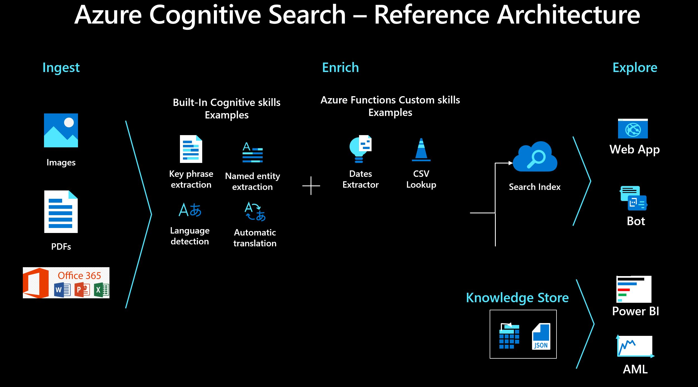

# Python Custom Skills Toolkit

This repo is a collection of useful functions to be deployed as custom skills for Azure Cognitive Search. The skills can be used as **templates or starting points** for your own custom skills, or they can be deployed and used as they are if they happen to meet your requirements. For enterprise/production/corporate environments, I suggest you change the code so that it complies with the performance and security requirements of your project, or your company. 

All code was written for Azure Functions in Python 3.7, to address specific projects requirements. Please read all the comments of the code to understand what was done, including limitations and restrictions. Again, adapt the code for your own requirements and needs.

## What is Azure Cognitive Search

Azure Cognitive Search (formerly known as "Azure Search") is a search-as-a-service cloud solution that gives developers APIs and tools for adding a rich search experience over private, heterogeneous content in web, mobile, and enterprise applications. Your code or a tool invokes data ingestion (indexing) to create and load an index. Optionally, you can add cognitive skills to apply AI processes during indexing. Doing so can add new information and structures useful for search and other scenarios.

To learn more about Azure Cognitive Search, click [here](https://docs.microsoft.com/en-us/azure/search/search-what-is-azure-search). 

## What are Azure Cognitive Search Custom Skills

The Custom Web API skill allows you to extend AI enrichment by calling out to a Web API endpoint providing custom operations. Similar to built-in skills, a Custom Web API skill has inputs and outputs. Depending on the inputs, your Web API receives a JSON payload when the indexer runs, and outputs a JSON payload as a response, along with a success status code. The response is expected to have the outputs specified by your custom skill. Any other response is considered an error and no enrichments are performed.

To learn more about Custom Skills, click [here](https://docs.microsoft.com/en-us/azure/search/cognitive-search-custom-skill-interface).

## What is Azure Functions

It is an event-driven serverless compute platform that can also solve complex orchestration problems. Build and debug locally without additional setup, deploy and operate at scale in the cloud, and integrate services using triggers and bindings.

To learn more about Azure Functions, click [here](https://azure.microsoft.com/en-us/services/functions/)

## Why to use Python for Custom Skills

Here are the technical factors to justify a [Python Custom Skill for Azure Cognitive Search](https://docs.microsoft.com/en-us/azure/search/cognitive-search-custom-skill-python) on top of Azure Functions:

+ Custom skills allow you to extend your Azure Search - Knowledge Mining solution trough REST API calls. 
+ Azure Functions is serverless hosting platform which Python support went to GA (General Availability) on August 19th, 2019. 
+ Python became the data science lingua franca, a common tongue that bridges language gaps within and between organizations. Because on containerization, community contributions and knowledge, open source libraries, and frameworks, a python code for custom skill allow you to easily deploy, migrate, or maintain the code.
  
## Reference Architecture

The image below gives you an example on how all of these services can work integrated into a Knowledge Mining solution.

I know how a customized slide can help POCs, Demos, Design Sessions, etc. If you want to customize this diagram, just use the provided [ppt](./slides) file.

## Suggested IDEs

Python allows you to use multiple IDEs like [Azure Notebooks](https://notebooks.azure.com/), [Azure Notebook VMs](https://azure.microsoft.com/en-us/blog/three-things-to-know-about-azure-machine-learning-notebook-vm/), [Visual Studio](https://visualstudio.microsoft.com/), etc.

My favorite IDE for this kind of project is [Visual Studio Code](https://code.visualstudio.com/) because on these key features:

+ [Azure Functions extension](https://marketplace.visualstudio.com/items?itemName=ms-azuretools.vscode-azurefunctions)
+ [Python extension](https://marketplace.visualstudio.com/items?itemName=ms-python.python)
+ [REST API extension](https://marketplace.visualstudio.com/items?itemName=mkloubert.vs-rest-api)
+ [Great  Tutorial](https://code.visualstudio.com/docs/languages/python)
+ [Locally integrated features: Development, tests, and deployment to Azure](https://docs.microsoft.com/en-us/azure/azure-functions/functions-create-first-function-vs-code)

## Best Practices

Here is a list of good practices from our experience when creating this solution for a client:

+ When possible, leverage [global variables](https://docs.microsoft.com/en-us/azure/azure-functions/functions-reference-python#global-variables) for the reference data. It is not guaranteed that the state of your app will be preserved for future executions. However, the Azure Functions runtime often reuses the same process for multiple executions of the same app. In order to cache the results of an expensive computation, declare it as a global variable.
+ Always prepare your code to deal with empty result sets, the filter will remove unwanted terms, nothing is replaced.
+ Save time debugging locally, I suggest VS Code or Postman for the job. You just need to save the new version of your python code and the changes are effective immediately, restart is not required.
+ In your code, use json.dumps on your output variable to validate what your skill returns to Cognitive Search. This will give you the opportunity to fix the layout in case of error.
+ The function **json.dumps()**, used in all skills to return the output, doesn't handle accentuation very well. To avoid strange characters and information loss, always use **ensure_ascii=False**.
+ For performance, prepare your code to process multiples documents in each execution, allowing you to use a batch sizes bigger than 1. Please check the loops within the provided sample code.
+ For production environments, change the code to be compliant with:
  + [Azure Functions Best Practices](https://docs.microsoft.com/en-us/azure/azure-functions/functions-best-practices)
  + Your environment security requirements.
  + [Python Best Practices](https://towardsdatascience.com/30-python-best-practices-tips-and-tricks-caefb9f8c5f5) Python Best Practices.

## Errors and Warnings

If you need errors and warnings management, use [this](https://docs.microsoft.com/en-us/azure/search/cognitive-search-custom-skill-python) link as a reference and change the code to add it. This best practice will be added to the skills code in the future, no ETA for now. PRs are welcome!

## Code - The Skills

Skill | When to Use
:---:|:---
[Bing Entity Search](./skills//bing-search/bing-search.md) | Gets Wikipedia information using the [Bing Entity Search API](https://docs.microsoft.com/en-us/rest/api/cognitiveservices-bingsearch/bing-entities-api-v7-reference). As an example, url extraction was implemented.
[CSV Filter](./skills/csv-filter/csv-filter.md) | Removes the csv file values from the input, returning a string clean of those values.
[CSV Lookup](./skills//csv-lookup/csv-lookup.md) | Extracts the csv file values that were found in the input string, returning an array of strings.
[Content Moderator](./skills//content-moderator/content-moderator.md) | Detects PII in the input string using the [Content Moderator API](https://azure.microsoft.com/en-us/services/cognitive-services/content-moderator/).
[CosmosDb Writter](./skills//cosmosdb-writer/cosmosdb-writer.md) | Writes your data into a [CosmosDb](https://docs.microsoft.com/en-us/azure/azure-functions/functions-bindings-cosmosdb-v2?tabs=python) collection.
[Dates Extractor](./skills/dates-extractor/dates-extractor.md) | Extracts dates from string. Differentiates itself from the [Entity Extraction built-in skill](https://docs.microsoft.com/en-us/azure/search/cognitive-search-skill-entity-recognition) by generating dates in yyyy-mm-dd HH:MM:SS format.
[Strings Distinct](./skills/strings-distinct/strings-distinct.md) | Removes duplicated elements from the input array. Useful when you are extracting entities or key phrases per page, and some values are present in multiple pages.
[Strings Merger](./skills/strings-merger/strings-merger.md) | Merges 2 strings. Differentiates itself from the [Text Merger built-in skill](https://docs.microsoft.com/en-us/azure/search/cognitive-search-skill-textmerger) by allowing you to merge any 2 strings, not only the content with the OCR text extracted from images.
[Strings Cleaner](./skills/strings-cleaner/strings-cleaner.md) | Removes special characters from strings, returning a string clean of those values.

## C# Custom Skills from the Azure Cognitive Search Product Team

For "official" Azure Search click-to-deploy C# Custom skills, created by the Azure Cognitive Search Team, use the [Azure Search Power Skills repo](https://github.com/Azure-Samples/azure-search-power-skills).

## Licensing and Collaboration

This code is 100% open source. Use it as you want.

I invite you to contribute your own work by submitting a pull request.

## About Me

My name is Rodrigo Souza and I work for Microsoft since 2017. For now my roles within the company were Data Solutions Architect, AI Instructor, and Applied Data Scientist. Nowadays I'm a Sr Data Scientist with [ACE Team](http://aka.ms/ACE-Blog). It is the AI Customer Engineering team, where I can work in interesting AI projects. Some key links are:

+ [My LinkedIn](https://www.linkedin.com/in/rodrigossz/)
+ [My Visual CV](https://github.com/Rodrigossz/CV)
+ [My Twitter](https://twitter.com/rodrigosqsz)
+ [My Data Architecture Blog](https://datanewoil.tumblr.com)
+ [Article: How I did become a Data Scientist](https://www.linkedin.com/pulse/how-did-i-become-data-scientist-rodrigo-souza/)
+ [Article: Using data and creativity to overcome challenges](https://www.linkedin.com/pulse/using-data-creativity-overcome-challenges-rodrigo-souza/)
+ [Article: DBAs in the Cloud & AI Age](https://www.linkedin.com/pulse/dbas-cloud-ai-age-rodrigo-souza/)

## Extra Links - Knowledge Mining - Azure Cognitive Search

+ Check the [Ace-Team Blog Posts](https://techcommunity.microsoft.com/t5/AI-Customer-Engineering-Team/bg-p/AICustomerEngineeringTeam/label-name/Knowledge%20Mining) to learn more about Knowledge Mining and AI.

+ To learn how to create a Knowledge Mining Bot, [here](https://aka.ms/kmb) for the Knowledge Mining Bootcamp, an end-to-end solution with step by step labs, no previous bots or .Net experience required. The tiny URL is https://aka.ms/kmb.

+ To accelerate your Knowledge Mining Business Opportunities, click [here](https://aka.ms/kma) to know the ACE's Team Knowledge Mining Accelerator. It is a read-only demo and also an open source code so you can easily deploy your own KM solution, including a customizable interface and dataset. In other words, bring your own data and logos, to accelerate demos, POCs, MVPs, etc. The tiny URL is https://aka.ms/kmb.

+ To Mine Knowledge from audio using Azure Cognitive Search and Speech to Text API, click [here](https://github.com/Rodrigossz/KM-w-Audio).
