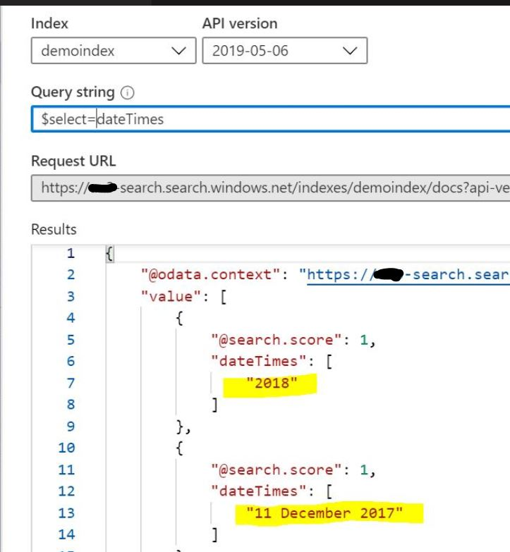

# Azure Cognitive Search Python Custom Skill For Dates Extraction

This code is a Python Custom Skill, for Azure Cognitive Search, based on Azure Functions for Python. It extracts the first date from the input string. If you need all of the dates, or the time, change the code as you need.

The Built-in [Entity Recognition cognitive skill](https://docs.microsoft.com/en-us/azure/search/cognitive-search-skill-entity-recognition) for dates will return all dates of the document, in multiple formats, as you can see in the image below. If it is not a problem for you, you don't need to use this custom skill.



## Required steps

1. Follow [this](https://docs.microsoft.com/en-us/azure/azure-functions/functions-create-first-function-python) tutorial.
1. Use the Python code below as your **__init__.py** file. Customize it with your storage account details, also with your csv file name and target column. As you can see below, my sample csv file target column name is **Term**. That helps the idea that this code will extract pre-defined terms from the documents content.
1. Don't forget to add **azure.functions** and **datefinder** to your requirements.txt file.
1. Connect your published custom skill to your Cognitive Search Enrichment Pipeline. Plesae check the section below the code in this file. For more information, click [here](https://docs.microsoft.com/en-us/azure/search/cognitive-search-create-custom-skill-example#connect-to-your-pipeline).
1. If you need errors and warnings management, use [this](https://docs.microsoft.com/en-us/azure/search/cognitive-search-custom-skill-interface#web-api-custom-skill-interface) link as a reference and change the code to add it.

## Python Code

```python
# Header - Standard for all skills:
# - Author: Rodrigo Souza - https://www.linkedin.com/in/rodrigossz/
# - This code is an Azure Cognitive Search Python Custom Skill.
# - The output is the "text" element within the "data" section of the json file.
# - For production environments add all best practices, logging, and error management that you need.
# - Letters cases are not changed. But if it is important for you, you can change the code as necessary.
# - All JSON files are returned with the original accents. For that, we use ensure_ascii=False.
# - Errors and warnings are not returned to the enrichment pipeline. Chage the code as you need to add this feature.
#
# Specific comments
# The output format is YYYY-MM-DD. Time is removed!!
# This code uses the datefinder library. Characteristics:
# 1) If the year is detected without month or day, it will be returned with today's month and day.
# 2) If month and date are detected without year, it will return the date with today's year.
# 3) The datafinder library will deal with empty stings and we will handle the outpout format
# For more details about datefinder: https://datefinder.readthedocs.io/en/latest/

import logging
import azure.functions as func
import re
import datefinder
import json
import datetime
import unicode

def main(req: func.HttpRequest) -> func.HttpResponse:
    logging.info('Python HTTP trigger function processed a request.')

    try:
        body = json.dumps(req.get_json())
    except ValueError:
        pass

    if body:
        return func.HttpResponse(run(body), mimetype="application/json")
    else:
        return func.HttpResponse(
             "Invalid Body.",
             status_code=555
        )


def run(json_data):
    
    values = json.loads(json_data)['values']
    
    # Prepare the Output before the loop
    results = {}
    results["values"] = []

    for value in values:
      # Getting the document text (content + OCR(?) + any other text been analyzed within your enrichment pipeline)
      
      try:
        myString = value['data']['text']
      except ValueError:
        pass

      if myString:
        # Converting to String and Removing Special Characters. The datefinder lib doesn't work very well with them .
        # Also removing accents
        myString=str(myString)
        myString = re.sub(r'\t',' ',myString)
        myString = re.sub(r'\n',' ',myString)
        myString = re.sub(r'  ',' ',myString)
        myString = unicode.unidecode(myString)

        # Getting the dates into an empty Generator
        matches = datefinder.find_dates(myString)

        #First Date only!!!! Change the code if you want all of them.
        for match in matches:
          myDate = match
          # Convert to string
          myDateString = str(myDate)
          break

        # Removing time!!! Change the code if you want it.
        if len(myDateString) > 1:
          myDateString = myDateString[0:10]
        else:
          myDateString = ''

        # Output
        recordId = value['recordId']
        results["values"].append(
              {
              "recordId": recordId,
              "data": {
                  "text": myDateString
                      }
              })
                    
    return json.dumps(results,ensure_ascii=False)
```
## Add this skill to your Cogntive Search Enrichment Pipeline

Your skillset will have this extra section below.

```json
 {
            "@odata.type": "#Microsoft.Skills.Custom.WebApiSkill",
            "name": "First Date",
            "description": "Get the first date detected in a string",
            "context": "/document",
            "uri": "your-Pyhton-Azure-Functions-published-URL",
            "httpMethod": "POST",
            "timeout": "PT30S",
            "batchSize": 1,
            "degreeOfParallelism": null,
            "inputs": [
             {
               "name": "text",
               "source": "/document/content"
             }
                   ],
        "outputs": [
          {
            "name": "text",
            "targetName": "date"
          }
            ],
            "httpHeaders": {}
           }
```

## Sample Input

One string has 2 dates, the second one has only the year.

```json
{
    "values": [
      {
        "recordId": "0",
        "data":
           {
             "text": "On November 5th 2017 I was hired by Microsoft. Today is 1/13/2020 and I am still working for the company"
           }
      },
      {
        "recordId": "1",
        "data":
           {
             "text": "I was born in 1974"
           }
      }
    ]
}
```

## Sample Output

From the first string, one date is returned. From the second, there is no month or day, so today's info is used.

```json
{
    "values": [
        {
            "recordId": "0",
            "data": {
                "text": "2017-11-05"
            }
        },
        {
            "recordId": "1",
            "data": {
                "text": "1974-01-13"
            }
        }
    ]
}
```

